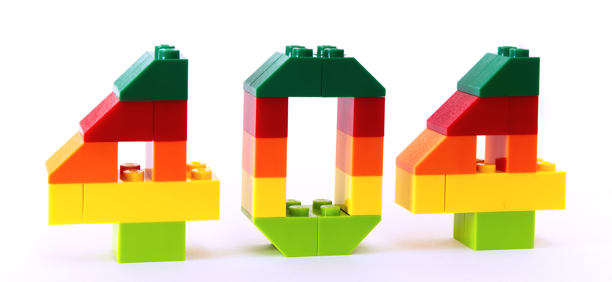

  
  

 
 

  <strong>Wanna grab these configuration files ?</strong>

  <a href='https://github.com/saahiluppal/configfiles/blob/main/nvim/init.vim'>
    </img>
  </a>
  <a href='https://github.com/saahiluppal/configfiles/blob/main/zshrc'>
    </img>
  </a>
  <a href='https://github.com/saahiluppal/configfiles/blob/main/kitty.conf'>
    </img>
  </a>

 

## 📝 Latest Blog Posts

 

<!-- BLOG-POST-LIST:START -->
- [AutoML-Zero](https://towardsdatascience.com/automl-zero-b2e065170941)
- [Curse of Batch Normalization](https://towardsdatascience.com/curse-of-batch-normalization-8e6dd20bc304)
- [SinGAN: Training GAN from a Single Image](https://towardsdatascience.com/singan-training-gan-from-a-single-image-cdd965af4406)
<!-- BLOG-POST-LIST:END -->

 

## &#x1f4c8; GitHub Stats

 

